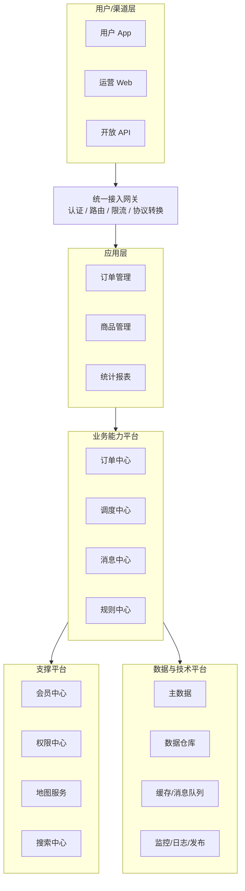
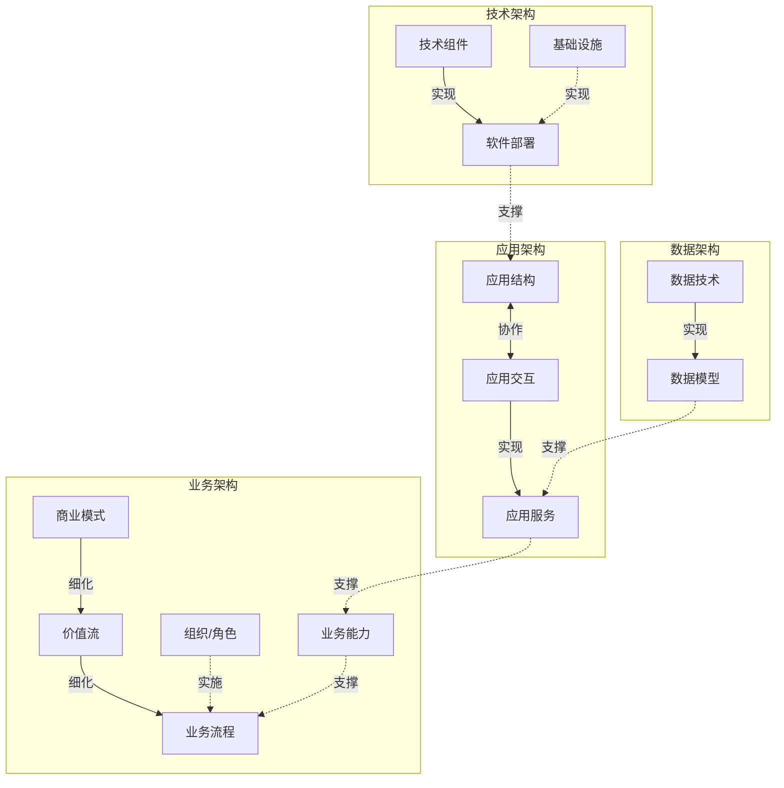
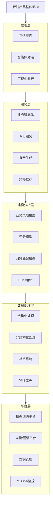

# Product Architecture Diagram Templates

Use these as starting points. Replace labels with the product's real modules. For user-facing deliverables, prefer the HTML patterns over Mermaid.

## HTML: Polished Layered Architecture

Create a standalone HTML file with this structure:

- `body` uses a neutral app background.
- `.toolbar` contains type tabs and export buttons.
- `#captureArea` is the only exported region.
- `.arch-title` is a full-width title bar.
- `.layer` rows are horizontal bands with a left `.layer-label` and right `.layer-content`.
- `.module` items are compact boxes with readable text.
- `.side-rail` may show monitoring/governance/DevOps as a vertical cross-cutting rail.

Minimum controls:

- `保存为 PNG`
- `保存为 JPG`
- A status text that reports success/fallback errors.

Use [html-export.md](html-export.md) for the export function.

## HTML: Type Variants

When demoing or offering alternatives, use one page with tabs:

- `分层平台图`: top-down product/platform layers.
- `业务关系图`: business/application/data/technology domains with dashed arrows.
- `能力地图`: capability groups in a matrix.
- `AI数据架构`: experience/service/model/data/platform layers.
- `C4容器图`: users, channels, services, datastores, external systems.

Each tab should keep the same export buttons and reuse `#captureArea`.

## Mermaid: Layered Platform Diagram

## Mermaid: Business/Application/Data/Technology Map

## Mermaid: AI/Data Product Layered Diagram

## HTML/SVG Visual Style Guidance

When making a polished screenshot-like visual:

- Use a neutral canvas, 1px borders, 4-8px radius, and vivid but professional fills by layer.
- Use dashed boundaries for architecture domains and solid boxes for concrete modules.
- Use side rails for cross-cutting observability, governance, security, and DevOps.
- Keep color semantic: business warm, application blue, risk/service red, model orange, data pink/purple/green, technology yellow/gray, governance dark blue.
- Avoid decorative gradients, icons that do not add meaning, and overly rounded cards.
- Avoid one-note palettes. A product architecture poster may be colorful, but each color should encode layer/domain meaning.

## Final Response Pattern

When returning a diagram, include:

1. Diagram artifact or code.
2. `图型选择`: one sentence naming the type and why.
3. `阅读方式`: 2-4 bullets explaining top-down or left-right logic.
4. `假设`: only if the source material had gaps.
