# 产品架构图 Image 2 风格目录

选择 `01-16`、`auto`（按内容匹配）或 `random`（灵感随机）。编号是稳定接口。

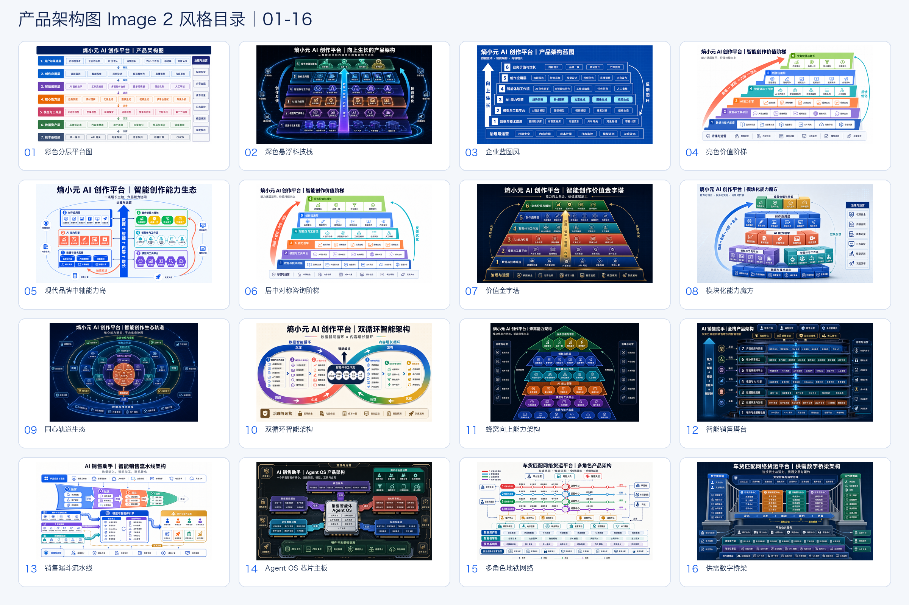

## 01｜彩色分层平台图

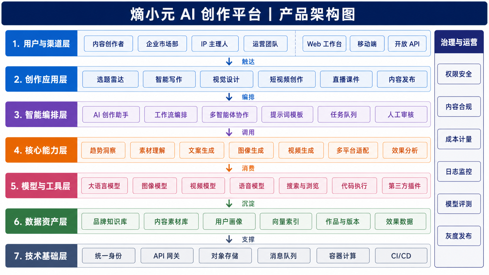

- 构图：自上而下的彩色水平架构层，右侧治理栏
- 适合：标准产品全景、SaaS平台、功能模块盘点、正式产品方案
- 提示词线索：白底或浅灰底；5至8层水平色带；左侧层名；中间模块网格；右侧治理与运营侧栏；蓝、紫、橙、绿语义配色。

## 02｜深色悬浮科技栈

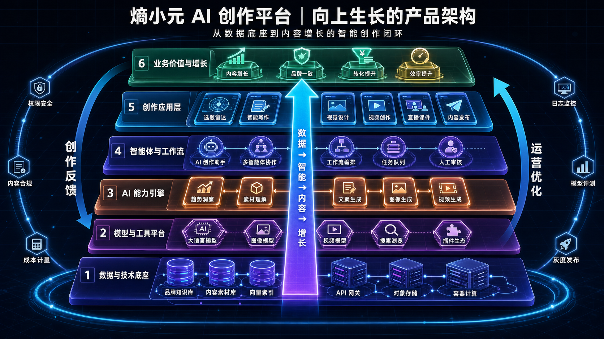

- 构图：六层悬浮平台、中央贯穿式上升箭头、双侧反馈弧线
- 适合：AI平台、技术发布会、模型与数据产品、强调科技感的方案
- 提示词线索：深蓝黑背景；悬浮平台逐层抬升；中央发光大箭头；克制霓虹描边；所有文字正面水平。

## 03｜企业蓝图风

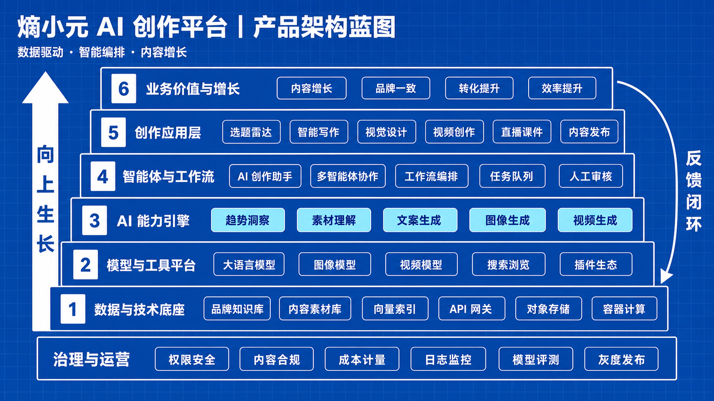

- 构图：蓝底白字、平面分层、粗线向上箭头
- 适合：政企方案、国企汇报、技术蓝图、正式大客户交付
- 提示词线索：纯企业蓝背景；白色字体和结构线；严格2D；无渐变无3D；左侧上升箭头；右侧反馈箭头。

## 04｜亮色价值阶梯

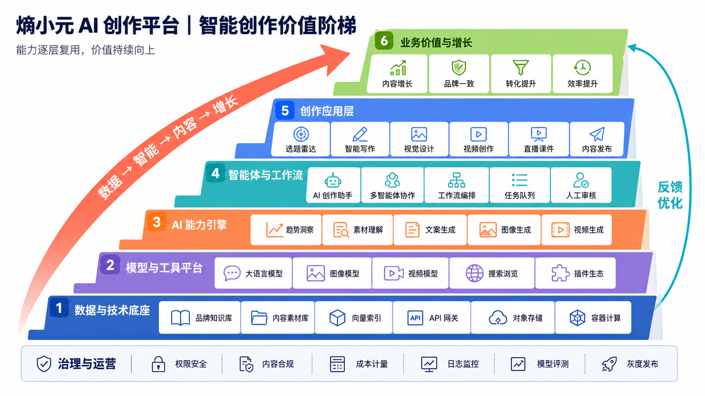

- 构图：左下到右上的六级价值阶梯与双向弧线
- 适合：能力成熟度、路线图、价值递进、战略咨询报告
- 提示词线索：暖白背景；阶梯从左下向右上；多彩扁平色块；外侧增长箭头；右侧反馈箭头。

## 05｜现代品牌中轴能力岛

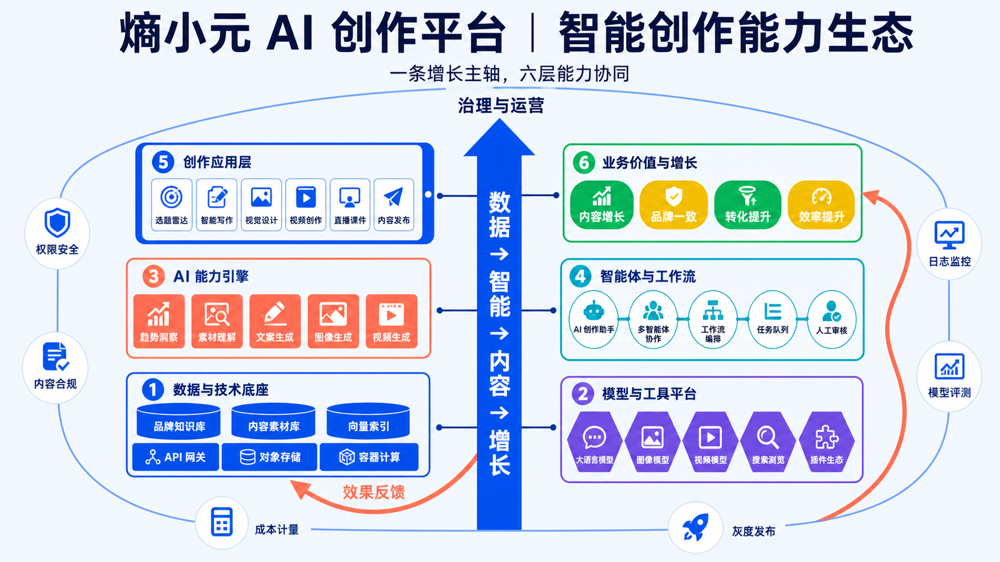

- 构图：中央增长主轴，能力岛左右交错，外围治理轨道
- 适合：品牌提案、产品发布、市场方案、强调增长主轴
- 提示词线索：极浅冰蓝背景；中央粗箭头；六个能力岛左右交错；高饱和品牌色；外围椭圆治理轨道。

## 06｜居中对称咨询阶梯

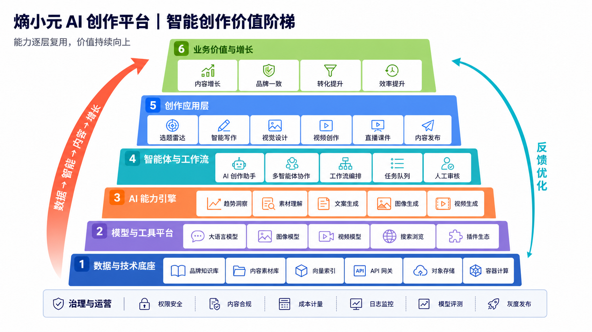

- 构图：围绕中轴对称、由下到上等距收窄的六层阶梯
- 适合：通用商务汇报、咨询方案、高管汇报、浅色PPT
- 提示词线索：暖白背景；所有层共用中轴线；底宽顶窄；左右等距缩进；两侧镜像弧线；底部治理栏。

## 07｜价值金字塔

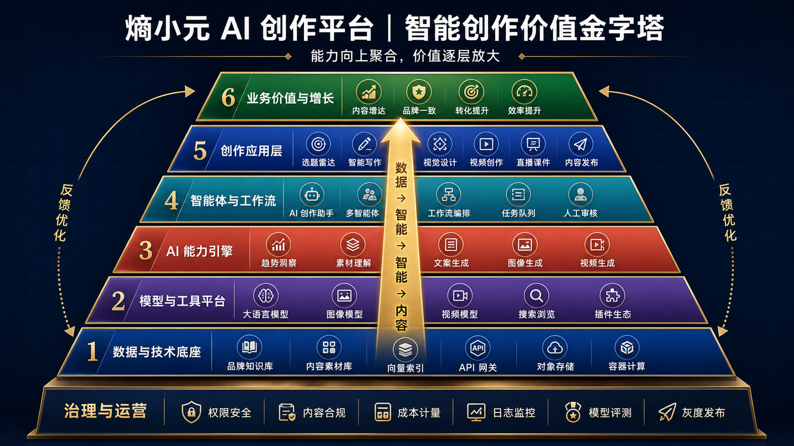

- 构图：居中六级截顶金字塔、中央金色上升箭头
- 适合：高层战略、能力聚合、价值放大、经营汇报
- 提示词线索：深海军蓝背景；六级对称金字塔；金色描边；中央上升箭头；双侧反馈弧线；稳定治理基座。

## 08｜模块化能力魔方

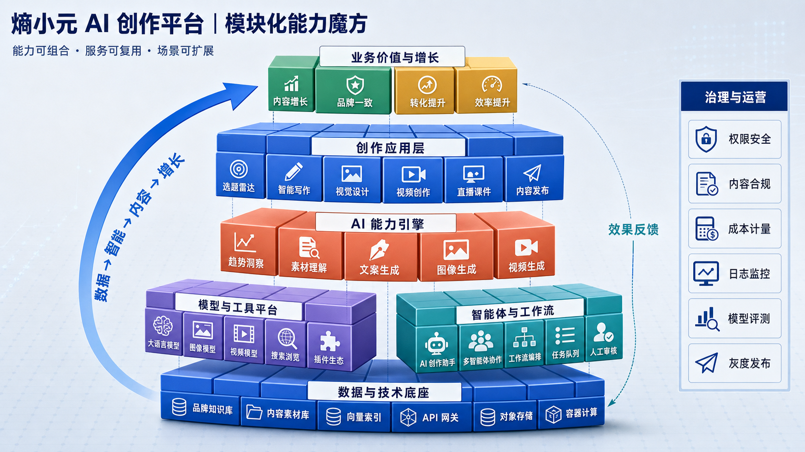

- 构图：略微拆解的工程化能力魔方与模块方块
- 适合：平台化、能力复用、产品组合、模块拼装
- 提示词线索：浅银蓝背景；2.5D模块方块；能力域分色；文字置于正面标签板；顶部业务价值模块；侧边治理栏。

## 09｜同心轨道生态

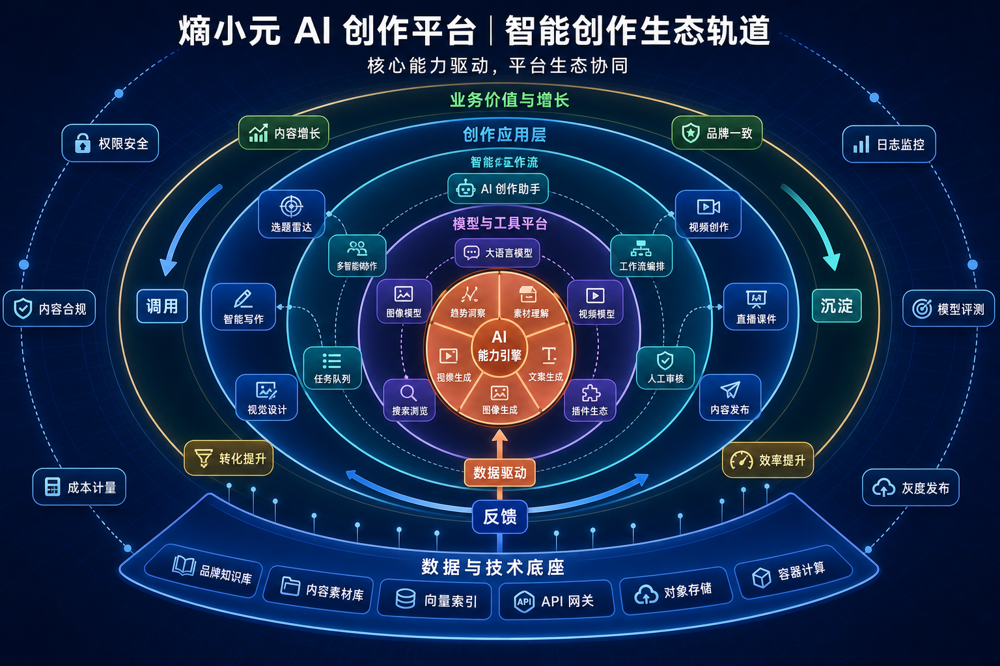

- 构图：AI核心、同心能力环、数据新月底座与外层治理轨道
- 适合：平台生态、能力辐射、合作伙伴体系、中心化AI引擎
- 提示词线索：深靛蓝背景；中心核心；四至五层同心环；底部数据底座；最外治理轨道；标签保持水平。

## 10｜双循环智能架构

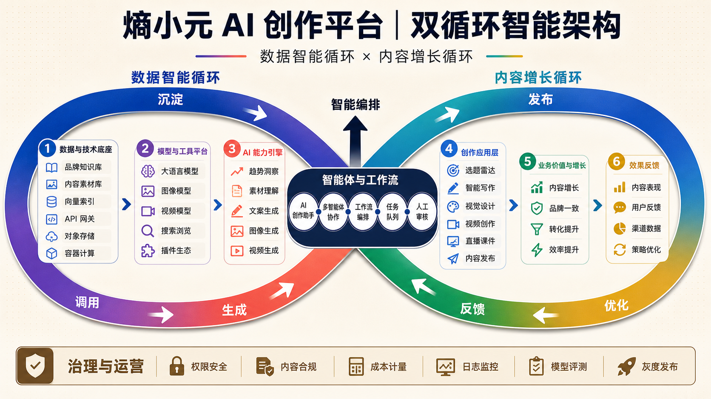

- 构图：数据智能循环与内容增长循环组成横向无限符号
- 适合：业务闭环、增长飞轮、持续反馈、运营优化
- 提示词线索：暖象牙白背景；巨大∞双循环；左数据智能、右业务增长；中央编排枢纽；底部治理栏。

## 11｜蜂窝向上能力架构

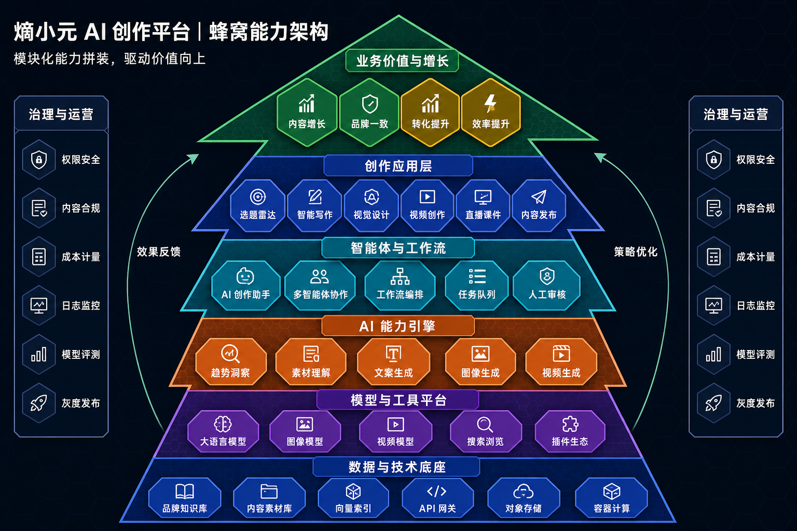

- 构图：六边形能力单元拼成整体向上的箭头
- 适合：能力中台、组件化、设计系统、可扩展技术平台
- 提示词线索：深石墨背景；六边形模块；整体形成上升箭头；能力域分色；左右治理侧栏；外侧反馈弧线。

## 12｜智能销售塔台

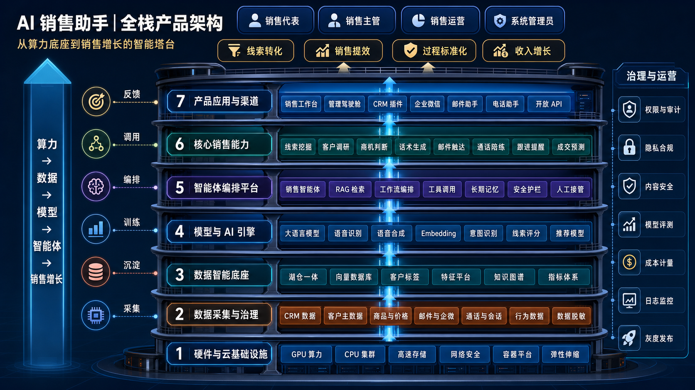

- 构图：从硬件到应用的七层纵向控制塔与中央数据主轴
- 适合：AI全栈产品、硬件到应用、垂直分层、技术与业务一体化
- 提示词线索：深蓝背景；七层控制塔剖面；中央数据能量轴；顶部用户与结果；右侧治理栏；层间关系动词。

## 13｜销售漏斗流水线

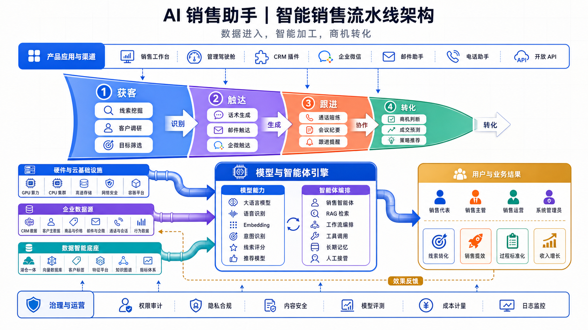

- 构图：数据供应管线、AI加工引擎与四阶段业务漏斗
- 适合：销售、营销、转化流程、业务价值链、端到端漏斗
- 提示词线索：暖白背景；左侧数据管线；中央模型与智能体引擎；上方四阶段漏斗；右侧用户与业务结果；反馈回路。

## 14｜Agent OS 芯片主板

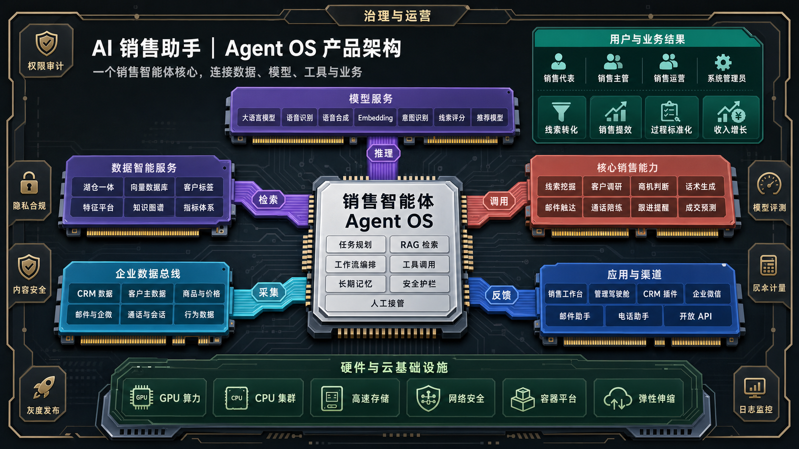

- 构图：中央智能体处理器、五条能力总线和外围治理边框
- 适合：Agent平台、模型服务、工具调用、数据总线、技术架构
- 提示词线索：石墨背景；中央Agent OS处理器；模型、数据、能力、渠道扩展卡；底部硬件基座；外围治理框。

## 15｜多角色地铁网络

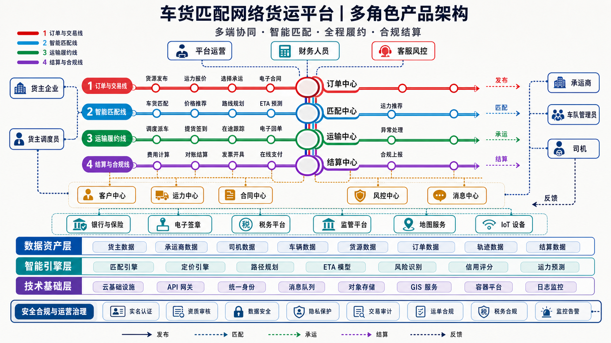

- 构图：多角色终点、四条业务线路、换乘中心和三层平台底座
- 适合：多端协同、多边平台、复杂角色、跨系统业务流程
- 提示词线索：浅色背景；彩色业务线路；圆形站点；大型换乘中心；角色分布四周并接入线路；数据算法技术底座。

## 16｜供需数字桥梁

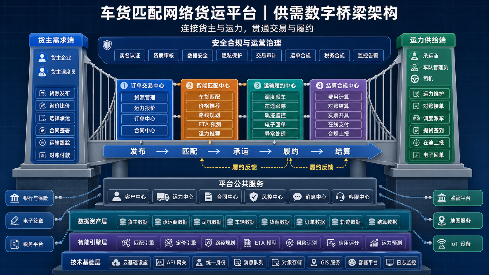

- 构图：左需求、右供给、桥面业务链、桥墩公共服务、地基数据技术
- 适合：双边市场、供需撮合、交易平台、连接型平台
- 提示词线索：深蓝工程背景；双侧角色桥塔；桥面业务链；桥墩公共服务；三层数据技术地基；桥索连接外部生态。
