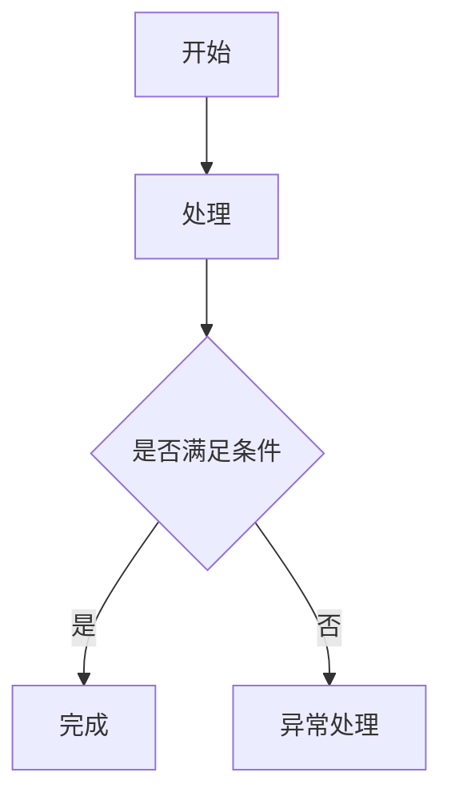

# PRD 文档模板

> 该模板综合参考功能需求说明书、传统 PRD 和商业需求文档的结构，重点覆盖：修订记录、业务范围、名词解释、背景目标、业务流程、页面元素、业务规则、功能详情、非功能需求、上线下线、验收标准和待确认问题。

## 0. 文档封面信息

| 项目 | 内容 |
| --- | --- |
| 文档名称 |  |
| 产品/系统名称 |  |
| 需求名称 |  |
| 文档版本 | V1.0 |
| 文档状态 | 草稿 / 评审中 / 已确认 / 已上线 |
| 作者 |  |
| 参与人 | 产品 / 设计 / 研发 / 测试 / 运营 / 客服 / 法务 / 财务 |
| 创建日期 |  |
| 最近更新 |  |
| 关联原型 |  |
| 关联流程图 |  |
| 关联需求池/任务 |  |

## 1. 修订记录

| 版本 | 日期 | 修改人 | 修订章节 | 修订原因 | 审批/确认人 | 备注 |
| --- | --- | --- | --- | --- | --- | --- |
| V1.0 |  |  | 初版 |  |  |  |

## 2. 文档说明

### 2.1 文档目的

说明本文档用于解决什么业务沟通问题，以及供哪些团队评审、研发、测试和验收使用。

### 2.2 适用业务范围

说明本需求覆盖的业务线、用户群、端类型、系统模块和组织范围。

### 2.3 本期范围

| 类型 | 内容 | 说明 |
| --- | --- | --- |
| 本期包含 |  |  |
| 本期不包含 |  |  |
| 前置依赖 |  |  |
| 后续规划 |  |  |

### 2.4 读者对象

| 角色 | 关注重点 |
| --- | --- |
| 业务方 | 业务目标、业务规则、流程边界 |
| 产品 | 范围、功能、规则、状态、验收 |
| 设计 | 页面结构、交互状态、异常反馈 |
| 研发 | 数据、字段、接口、权限、状态流转 |
| 测试 | 验收标准、异常场景、边界条件 |
| 运营/客服 | 后台操作、人工处理、服务流程 |
| 法务/财务/安全 | 合规、成本、风控、安全规则 |

### 2.5 参考资料

| 编号 | 资料名称 | 链接/路径 | 说明 |
| --- | --- | --- | --- |
| REF-001 |  |  |  |

### 2.6 名词解释

| 名词 | 说明 |
| --- | --- |
|  |  |

## 3. 背景与目标

### 3.1 业务背景

描述当前业务现状、问题来源、用户痛点、业务方诉求和为什么现在要做。

### 3.2 需求目标

| 目标 | 衡量方式 | 备注 |
| --- | --- | --- |
|  |  |  |

### 3.3 成功指标

| 指标 | 当前值 | 目标值 | 数据来源 | 统计周期 |
| --- | --- | --- | --- | --- |
|  |  |  |  |  |

### 3.4 风险与约束

| 风险/约束 | 影响 | 应对策略 | 责任方 |
| --- | --- | --- | --- |
|  |  |  |  |

## 4. 用户与场景

### 4.1 用户角色

| 角色 | 角色说明 | 核心诉求 | 权限边界 |
| --- | --- | --- | --- |
|  |  |  |  |

### 4.2 使用场景

| 场景 | 触发条件 | 用户目标 | 当前问题 | 期望结果 |
| --- | --- | --- | --- | --- |
|  |  |  |  |  |

## 5. 业务流程

### 5.1 主流程

用文字描述主流程，并附流程图或 Mermaid 源码。

### 5.2 分支与异常流程

| 异常场景 | 触发条件 | 系统处理 | 用户反馈 | 人工处理 | 最终状态 |
| --- | --- | --- | --- | --- | --- |
|  |  |  |  |  |  |

### 5.3 状态流转

| 当前状态 | 触发动作 | 下一状态 | 操作角色 | 系统动作 | 备注 |
| --- | --- | --- | --- | --- | --- |
|  |  |  |  |  |  |

## 6. 功能总览

| 模块 | 功能点 | 优先级 | 使用角色 | 端/系统 | 备注 |
| --- | --- | --- | --- | --- | --- |
|  |  | P0/P1/P2 |  |  |  |

## 7. 功能详细说明

> 每个核心功能都按以下结构展开。

### 7.x 功能名称

#### 7.x.1 功能描述

说明功能解决什么问题，用户在什么场景下使用。

#### 7.x.2 入口与权限

| 项目 | 说明 |
| --- | --- |
| 功能入口 |  |
| 可见角色 |  |
| 可操作角色 |  |
| 权限限制 |  |

#### 7.x.3 业务流程

说明该功能的局部流程，可附流程图。

#### 7.x.4 页面/界面说明

说明页面结构、主要区域、操作入口、跳转关系、弹窗、抽屉、确认提示、空态、加载态、失败态。

#### 7.x.5 页面元素表

| 序号 | 页面区域 | 数据项/控件 | 类型/输入方式 | 是否必填 | 默认值 | 校验/管理规则 | 输出/联动 |
| --- | --- | --- | --- | --- | --- | --- | --- |
| 1 |  |  | 文本/选择器/按钮/列表/上传/日期 | 是/否 |  |  |  |

#### 7.x.6 业务规则

| 编号 | 规则名称 | 规则说明 | 触发时机 | 影响范围 | 异常处理 |
| --- | --- | --- | --- | --- | --- |
| R-001 |  |  |  |  |  |

#### 7.x.7 业务逻辑

用步骤说明系统判断、计算、调用、状态变更和数据写入逻辑。

1. 
2. 
3. 

#### 7.x.8 消息与通知

| 场景 | 通知对象 | 通知方式 | 文案 | 触发条件 |
| --- | --- | --- | --- | --- |
|  |  | 站内信/短信/邮件/企微/系统提示 |  |  |

#### 7.x.9 验收标准

| 编号 | 验收项 | 前置条件 | 操作步骤 | 预期结果 |
| --- | --- | --- | --- | --- |
| AC-001 |  |  |  |  |

## 8. 数据与接口需求

### 8.1 数据字段

| 字段 | 类型 | 来源 | 是否必填 | 说明 |
| --- | --- | --- | --- | --- |
|  |  |  |  |  |

### 8.2 数据口径

| 指标/口径 | 定义 | 计算方式 | 数据来源 | 刷新频率 |
| --- | --- | --- | --- | --- |
|  |  |  |  |  |

### 8.3 接口/系统依赖

| 依赖系统 | 依赖能力 | 输入 | 输出 | 异常处理 | 责任方 |
| --- | --- | --- | --- | --- | --- |
|  |  |  |  |  |  |

## 9. 非功能需求

| 类型 | 要求 | 验收方式 |
| --- | --- | --- |
| 性能 |  |  |
| 安全 |  |  |
| 权限 |  |  |
| 兼容 |  |  |
| 可用性 |  |  |
| 日志审计 |  |  |
| 帮助与客服 |  |  |
| 法务合规 |  |  |
| 财务/结算 |  |  |

## 10. 上线、下线与运营计划

### 10.1 上线计划

| 事项 | 时间 | 责任方 | 备注 |
| --- | --- | --- | --- |
|  |  |  |  |

### 10.2 灰度与回滚

| 场景 | 策略 | 触发条件 | 责任方 |
| --- | --- | --- | --- |
| 灰度 |  |  |  |
| 回滚 |  |  |  |

### 10.3 下线需求

| 下线对象 | 下线时间 | 数据处理 | 用户/业务通知 |
| --- | --- | --- | --- |
|  |  |  |  |

### 10.4 运营支持

说明是否需要运营配置、活动投放、客服话术、帮助中心、培训材料或数据看板。

## 11. 协作评审清单

| 部门/角色 | 是否需要评审 | 关注内容 | 结论 |
| --- | --- | --- | --- |
| 业务方 | 是/否 | 业务规则、流程边界 |  |
| 设计 | 是/否 | 页面、交互、状态 |  |
| 研发 | 是/否 | 技术方案、接口、数据 |  |
| 测试 | 是/否 | 验收、异常、边界 |  |
| 运营/客服 | 是/否 | 操作流程、话术、人工处理 |  |
| 法务/财务/安全 | 是/否 | 合规、成本、风险 |  |

## 12. 待确认问题

| 编号 | 问题 | 影响范围 | 建议确认人 | 截止时间 | 状态 |
| --- | --- | --- | --- | --- | --- |
| Q-001 |  |  |  |  | 未确认 |

